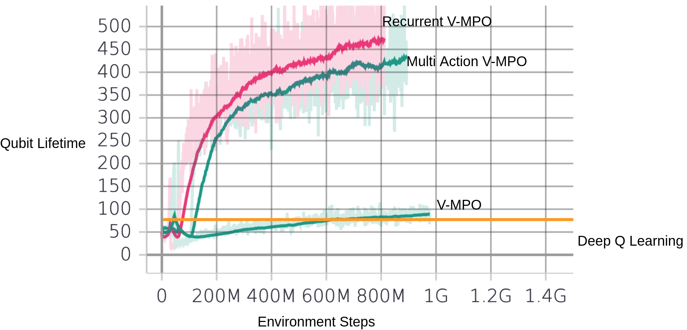

# quantum_error_correction
This project improves on work from Sweke et al.
In particular, the environment simulation has been mostly copied from https://github.com/R-Sweke/DeepQ-Decoding.

    R. Sweke, M.S. Kesselring, E.P.L. van Nieuwenburg, J. Eisert,
    Reinforcement Learning Decoders for Fault-Tolerant Quantum Computation,
    arXiv:1810.07207 [quant-ph], 2018.  

The training with the DQN algorithn can be started with training.py.
Additionaly, we have implemented On-Policy maximum a posteriori policy optimization.

    H Francis Song, Abbas Abdolmaleki et al.
    V-mpo:On-policy maximum a posteriori policy optimization for discrete and continuous control,
    ICLR 2020

vmpo_training.py uses a slightly modified environment from Sweke at al.
The environment doesn't execute the referee decoder itself. Instead, it returns the input and correct
output in the info dict. The collector can then combine the inputs from multiple environments and
use the referee decoder with a large batch size. This is much faster.

multi_action_vmpo_training starts training with a simplified environment interaction. It uses 
independent bernoulli distributions for all possible pauli operations. Thus it can execute multiple pauli
operations in one feed-forward pass.

Here is a comparison:
